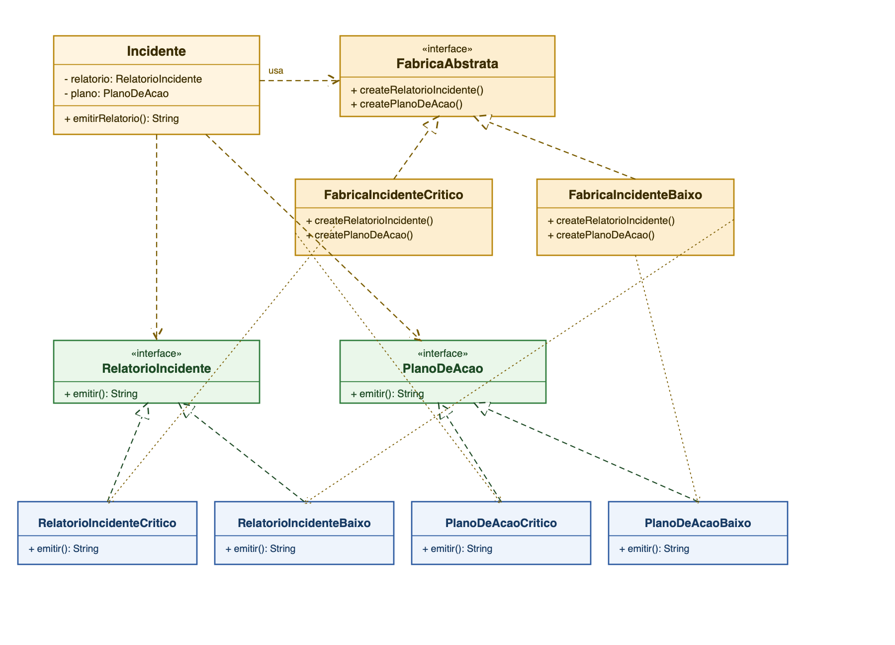

# Abstract Factory — Resposta a Incidentes de Segurança

Implementação do padrão de projeto **Abstract Factory**, aplicada a um sistema de resposta a incidentes de segurança: duas famílias de produtos relacionados, por severidade do incidente (Crítico e Baixa Severidade).

## Estrutura

- `RelatorioIncidente`, `PlanoDeAcao` — interfaces de produto.
- `RelatorioIncidenteCritico`, `PlanoDeAcaoCritico` — família "Crítico".
- `RelatorioIncidenteBaixo`, `PlanoDeAcaoBaixo` — família "Baixa Severidade".
- `FabricaAbstrata` — interface da fábrica, declara `createRelatorioIncidente()` e `createPlanoDeAcao()`.
- `FabricaIncidenteCritico`, `FabricaIncidenteBaixo` — fábricas concretas, cada uma garantindo que os dois produtos criados pertençam à mesma família.
- `Incidente` — cliente: recebe a fábrica no construtor e usa os produtos sem conhecer suas classes concretas.

## Diagrama UML



Versão editável em Mermaid: [docs/diagrama-uml.md](docs/diagrama-uml.md).

## Como rodar os testes

```
mvn test
```
