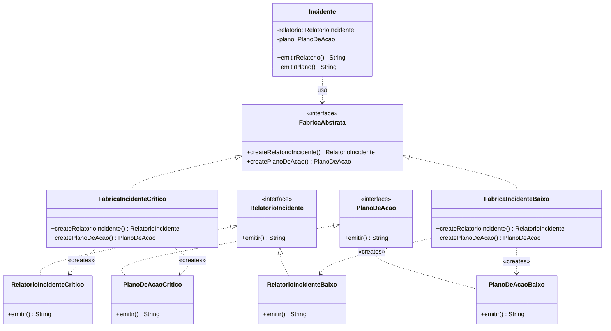

# Diagrama UML — Abstract Factory (Resposta a Incidentes de Segurança)

O GitHub renderiza o bloco abaixo automaticamente como diagrama ao visualizar este arquivo no repositório.

```mermaid
classDiagram
    class FabricaAbstrata {
        <<interface>>
        +createRelatorioIncidente() RelatorioIncidente
        +createPlanoDeAcao() PlanoDeAcao
    }

    class FabricaIncidenteCritico {
        +createRelatorioIncidente() RelatorioIncidente
        +createPlanoDeAcao() PlanoDeAcao
    }

    class FabricaIncidenteBaixo {
        +createRelatorioIncidente() RelatorioIncidente
        +createPlanoDeAcao() PlanoDeAcao
    }

    class RelatorioIncidente {
        <<interface>>
        +emitir() String
    }

    class PlanoDeAcao {
        <<interface>>
        +emitir() String
    }

    class RelatorioIncidenteCritico {
        +emitir() String
    }

    class RelatorioIncidenteBaixo {
        +emitir() String
    }

    class PlanoDeAcaoCritico {
        +emitir() String
    }

    class PlanoDeAcaoBaixo {
        +emitir() String
    }

    class Incidente {
        -relatorio: RelatorioIncidente
        -plano: PlanoDeAcao
        +emitirRelatorio() String
        +emitirPlano() String
    }

    FabricaAbstrata <|.. FabricaIncidenteCritico
    FabricaAbstrata <|.. FabricaIncidenteBaixo
    RelatorioIncidente <|.. RelatorioIncidenteCritico
    RelatorioIncidente <|.. RelatorioIncidenteBaixo
    PlanoDeAcao <|.. PlanoDeAcaoCritico
    PlanoDeAcao <|.. PlanoDeAcaoBaixo
    Incidente ..> FabricaAbstrata : usa
    FabricaIncidenteCritico ..> RelatorioIncidenteCritico : «creates»
    FabricaIncidenteCritico ..> PlanoDeAcaoCritico : «creates»
    FabricaIncidenteBaixo ..> RelatorioIncidenteBaixo : «creates»
    FabricaIncidenteBaixo ..> PlanoDeAcaoBaixo : «creates»
```
